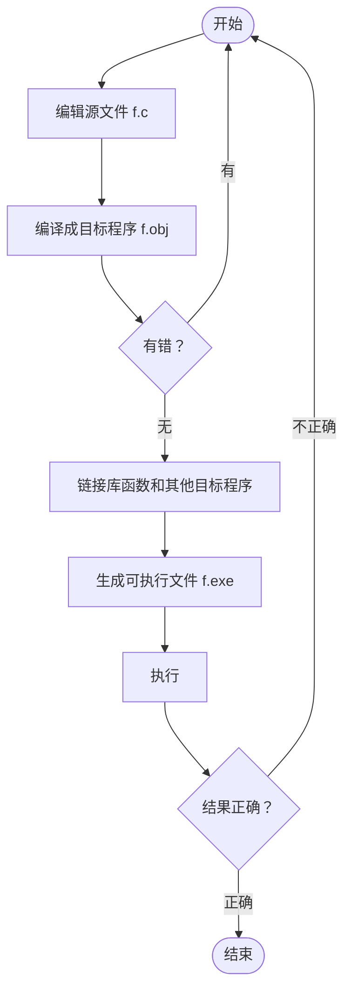

# 一丨C 语言的发展过程

## 计算机语言发展的三个阶段

- 机器语言 
    - 完全由 0, 1 二进制代码组成，计算机可直接识别

- 汇编语言 
    - 由英文、符号组成的符号语言，便于记忆掌握（类似指令，用指令词汇，即助记符，代替二进制）

- 高级语言
    - 由各种标识符、运算符和表达式组成，是以“人”的思维逻辑来描述电脑运行的语言


## C 语言发展的三个阶段

- 诞生阶段：1960 - 1973 年
    - unix 系统促使 c 语言问世

- 发展阶段：1973 - 1988 年
    - c 语言在 unix 系统上推广

- 成熟阶段：1988 年 →
    - c 不断发展，出现各种 c 语言版本

- c 语言是在 b 语言的基础上发展起来的，最初为了编写 unix 操作系统而编写
- 它与 unix 操作系统相辅相成，共同发展，目前已经完全独立于 unix 应用于各种应用程序的编写
- C++ 进一步扩充和完善了 c 语言，与 c 语言在很多方面是兼容的

# 二丨C 语言的特点

- 介于高级语言和机器语言之间
    - 允许直接访问物理地址，能进行位操作，能实现汇编语言大部分功能，可直接对硬件进行操作

- 采用结构化编程
    - 采用函数作为程序的模块，程序结构清晰，可读性好

- 可移植性好
    - 基本上不做修改就能应用于各种类型的计算机和操作系统

- 目标代码质量高
    - 程序执行效率高。只比汇编程序生产的目标代码效率低 10%-20%，工作量小，易于调试

# 三丨简单的 C 语言程序介绍

```c
#include <stdio.h>                  // 代码头
void main() {                       // 主函数 + 函数体开始
    printf("This is a C program");  // 输出
}                                   // 函数体结束
```

说明：
- 使用标准库函数时应在程序开头一行写 `#include <stdio.h>`
- 每个 c 程序都有且仅有一个主函数，main 是主函数名，void 表示无返回值
- {} 括起的部分为函数体，由语句组成，用来描述所进行的操作。每个 c 语句以分号结束。（批注：整个代码的入点，无论是单文件还是头源分离的项目）
- printf 函数的功能是把要输出的内容送到显示器去显示。（批注：这条解释的非常不精确）
- printf 函数是一个由系统定义的标准函数，可在程序中直接调用。

# 四丨运行 C 语言程序的步骤和方法

一、运行 C 程序的步骤
- 上机输入与编辑源程序，生成 C 源程序文件，扩展名为 .c
- 对源程序进行编译，生成目标文件，扩展名为 .obj
- 与库函数链接，生成可执行文件，扩展名为 .exe
- 运行程序，得到结果



